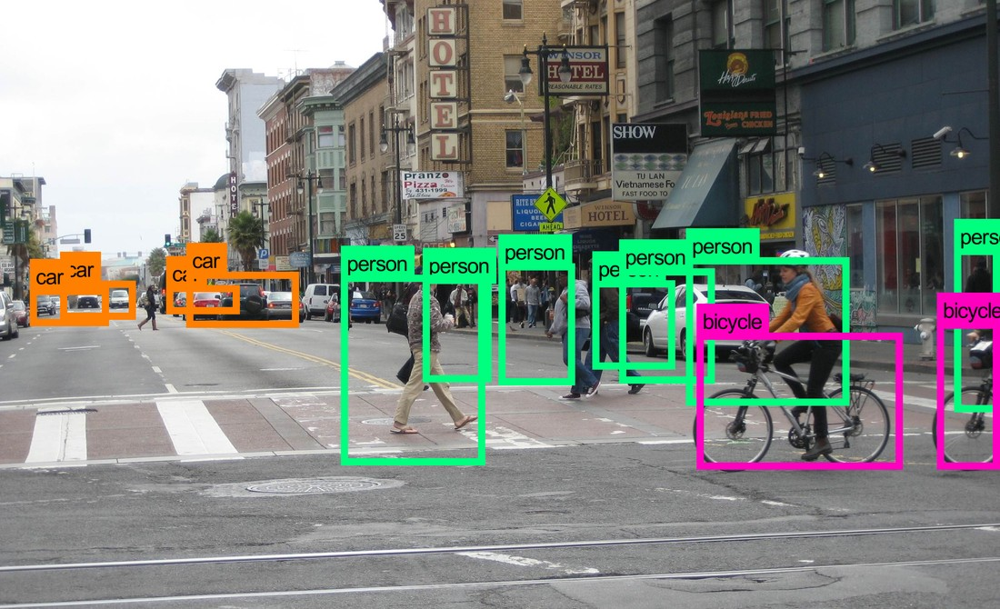

# Image Processing and Computer Vision 👁️



This repository contains all of the code and other resources related to the <b>Image Processing and Computer Vision</b> module (CS3042) conducted by <a href="https://www.linkedin.com/in/kaneeka-vidanage-902a7292/">Dr. Kaneeka Vidanage</a> of the Faculty of Computing, General Sir John Kotelawala Defence University in 2024.

This repository is only meant to be a reference for this module, but you are free to clone and run the code in this repository.

## Setup ⚙️

If you need to run these notebooks and experiment with them, follow these steps to set up this repository locally on your system.

### Prerequisites

1. <a href="https://git-scm.com/">Git</a>
2. <a href="https://www.python.org/">Python</a> (recommended to have version 3.9.0 or above)

The <a href="https://www.anaconda.com/">Anaconda</a> software suite is not necessary to be installed in your system, since we can use Python's `virtualenv` to manage dependencies properly.

After Python has been set up, install the `virtualenv` package to create and manage a virtual environment for this project. This helps you maintain the project's dependencies in a hassle-free manner, without installing any unnecessary packages globally throughout your system.

```
pip install virtualenv
```

### 1. Clone the Project

Clone this project to create a local copy of it on your system in a desired location:

```shell
git clone "https://github.com/ravi-aratchige/IPCV.git"
```

Then, move into the project folder:

```shell
cd IPCV
```

### 2. Create a Virtual Environment

Create a virtual environment inside the project folder to isolate its dependencies:

```shell
python -m venv env

# or

python3 -m venv env
```

Next, activate the virtual environment:

```shell
# on Windows:
.\env\Scripts\activate

# on MacOS or Linux
source env/bin/activate
```

You can deactivate this environment when you are done working with the project:

```shell
# on Windows, MacOS or Linux
deactivate
```

### 3. Install Dependencies

Set up your project with the necessary packages and libraries. <b>After activating the virtual environment</b>, enter the following command:

```shell
pip install -r requirements.txt
```

Or, you can also use:

```shell
pip install notebook opencv-python numpy matplotlib face_recognition easyocr tensorflow pillow ipython
```

This process may take a considerable amount of time, as several packages must be downloaded. It is recommended to have a <b>good Internet connection</b> before installing these requirements.

### 4. Start Jupyter Server

After you have completed the above steps, you can start the Jupyter server to view the notebooks.

```shell
jupyter notebook
```

Jupyter will begin serving in `localhost:8888`.

## Issues 🚩

If you face any issues while setting up the project locally, or notice any problems in the notebooks' code, you can <a href="https://github.com/ravi-aratchige/IPCV/issues">open an issue</a> describing the problem you encountered.

## Contribution 💁

Contributions are always welcome; you may fork this project, work on it and submit a pull request.

This project is still underway, so you can expect changes often!

### To-Do

- [ ] Fix triangle detection bug (last image in `Shapes.ipynb`)
- [ ] Write explanation for face detection with intelligent template matching
- [ ] Migrate dependency management to <a href="https://python-poetry.org/">Poetry</a>

<hr />

Made with :heart: by Ravindu Aratchige. Licensed under the <a href="https://github.com/ravi-aratchige/IPCV/blob/main/LICENSE">Apache License<a>.


